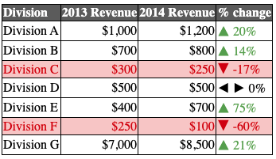

# SheetsToHtml

## Scenario

You have have spent some time formatting a Google Sheets table and it looks just as you want it to look.
However, what if you would like to embed it in a Markdown document or an HTML page? You could of course take a screenshot and embed the image in either type of document but that's not a very neat solution.
What if you could convert the Sheets table to HTML in such a way that all your formatting is preserved. That includes colours, merged cells, bold, italics, font size, etc. I wrote this GAS code to do just that. It takes an input range and then generates output as an HTML table that preserves the formatting as much as possible. As the example code shows, you can use it to:

1. Generate a full HTML document.
2. Just the table HTML.

### Example output

The image on the left is of the input spreadsheet data, while the one on the right is the generated HTML version as rendered by the browser. They are not exact copies of each other but as close enough for my purposes.

If any of this is of interest to you or if you are simply just interested in seeing how such a transformation can be performed in Google Apps Script (GAS), then read on.

## Running the code

- The code is available here in this repo, see JS file _SheetsToHtml.js_. I gave it a _.js_ extension because I used JSDoc to generate documentation and it does not recognise the _.gs_ extension.
- You can view all the JSDoc output in the folder named __JSDocs__ in this repo.
- You can also go to this link and make your own copy of the spreadsheet, then go into the Apps Editor and run the two functions ( _fullPageHtml_ and _tableHtmlOnly_ ) in the _Code.gs_ file: [Shared link to the spreadsheet](https://docs.google.com/spreadsheets/d/1UEGjJVPpmNRXyzRKGPnVAKwdWbj4TIwUSIN_nQmL250/edit?usp=sharing)
- Because the two example functions in _Code.gs_ write files to your Google Drive, you need to authorise them in the usual way.
- Once you have executed each of those functions, two new files should appear in your Google Drive called _sales_table.html_ and _sales_full.html_.
- You can download these files and open them in your browser to see how they are rendered as webpages. Surprisingly, Chrome even renders the version that contains the table HTML only too. I've not checked with other browsers.

## Uses of the output

- Raw HTML can be embedded in Markdown so I use the table-only output when writing Markdown documents.
- For example, when using Markdown in R Studio, I often just copy the GAS HTML output directly into the Mardown and then render it as a webpage using R Studio's _preview_

## Code notes

- There is quite a lot of code in the _SheetsToHtml.gs_ script.
- The code has to map the Google Sheets formatting to its HTML equivalent.
- such a mapping is not straightforward because things like __colours__ and __merged cells__ are specified very differently in the two representations.
- I wrote the main code using ES6 __classes__. I think it is really good that GAS has incorporated these general JavaScript enhancements because they simplify the code and make it look more like "conventional" OO languages.
- I have also used __properties__, another ES6 enhancement.
- Writing this type of functionality in GAS is much easier than in Excel VBA. I have tried this in VBA and, believe me, the effort made me appreciate what GAS has to offer over VBA for this type of task.
- That said, it could be done in VBA bt it would take considerably more effort.

## Using with Excel

- To make this work with Excel, you can import the Excel sheet into Google Sheets, convert it to a Google Sheet, and then run the HTML table-generating code on that. 
- Some Excel formats may be lost but it works for most of what I have tried

## Limitations

- This code works for me and I am especially happy with how it deals with things like embedded emojis and merged cells.
- The generated HTML table may not be an exact simulacrum of its Sheets representation but it is close enough for my purposes.
- There may be types of formatting that this code ignores or transforms incorrectly. Please let me know if you encounter these.

## Closing notes

- This code works for me but there are no guarantees. If you use it, please make sure you have read these notes and perused the JSDoc output.
- Feel free to contribute and issue a pull request if you so wish.
